# 
Crypilot

A web3 wallet, integrating custodian, quotation, and trading features to make it easier for web3 beginners to experience Blockchain.

## 👨🏻‍💻 User Flow

### Testing Account

- email: appworks@gmail.com
- password: 123

#### 1. Register

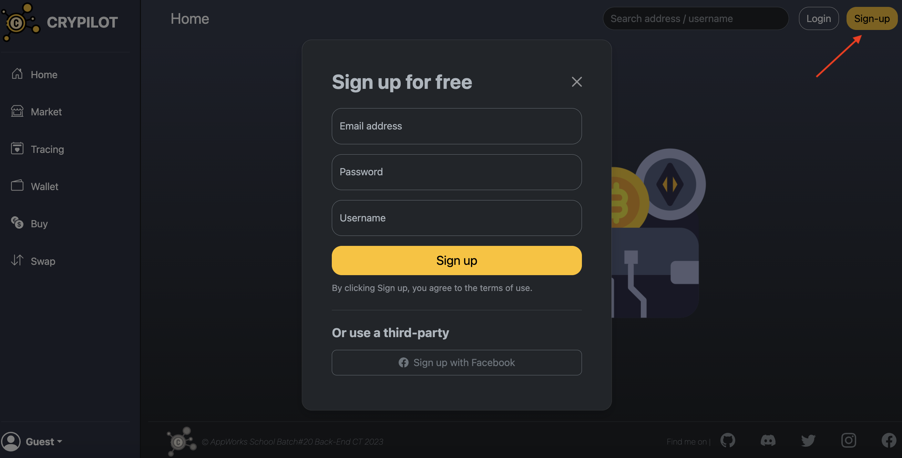

#### 2. Login

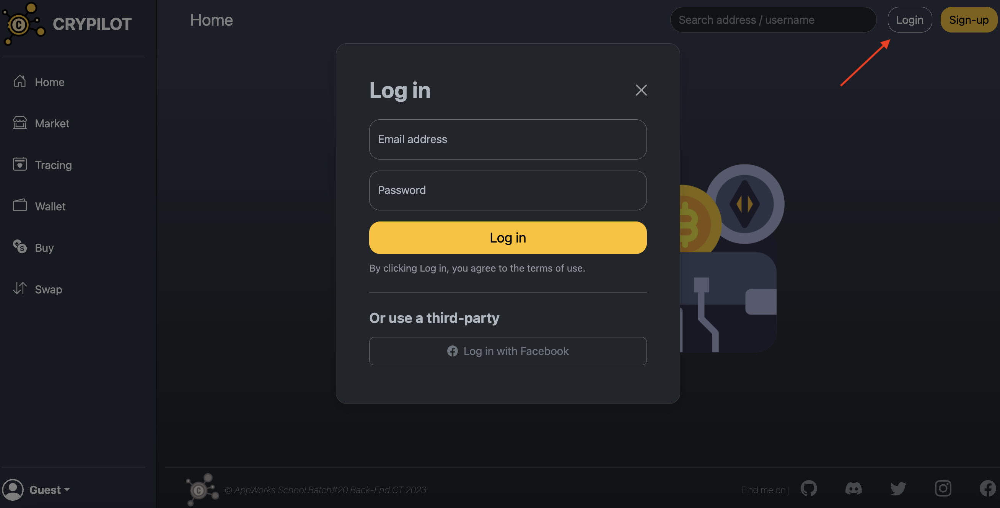

#### 3. Profile page, check percent of assests and ETH balance.

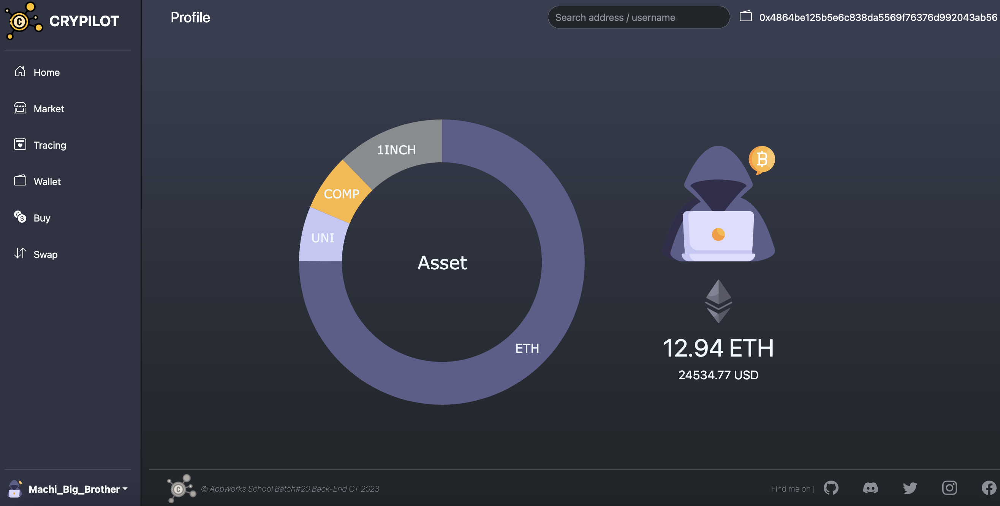

#### 4. Set the 2FA for assets security.

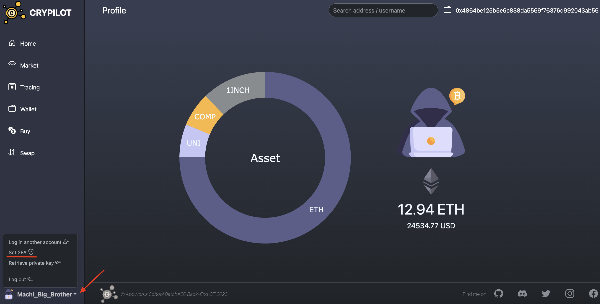

#### 5. Market page, get instant price of cryptos and add the interesting crypto into tracing list. Furthermore, click the chat button, obtain crypto information from ChatGPT.

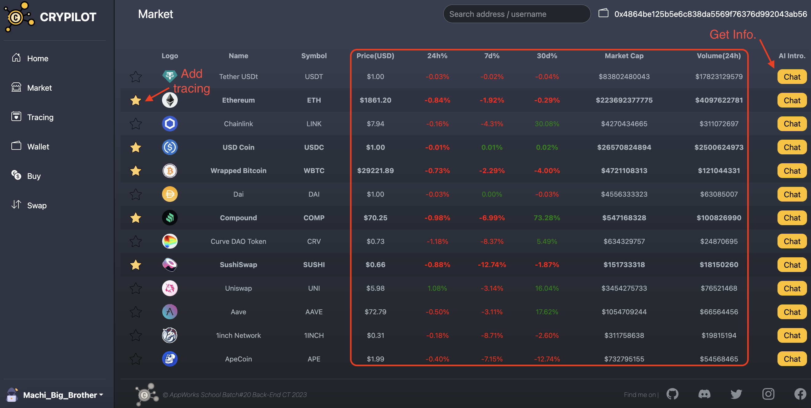
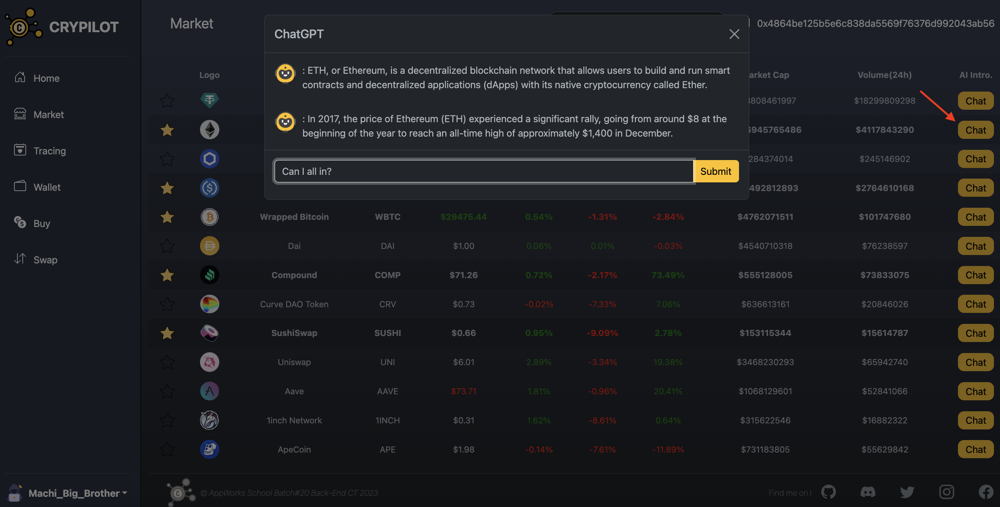

#### 6. Tracing page, check your all tracing cryptos.

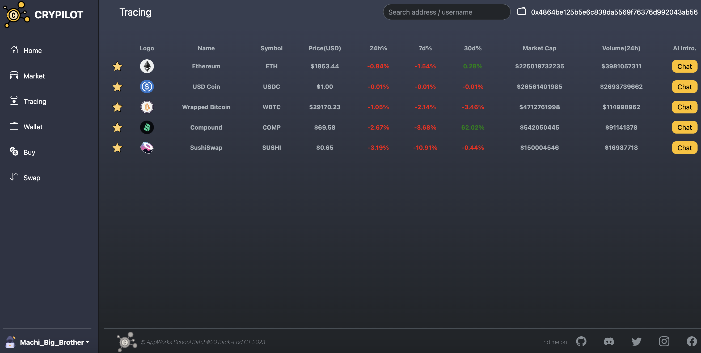

#### 7. Buy page, buy ETH by fiat currency through credit card.

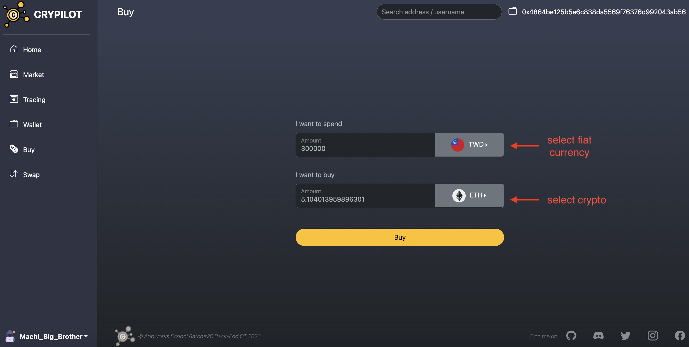
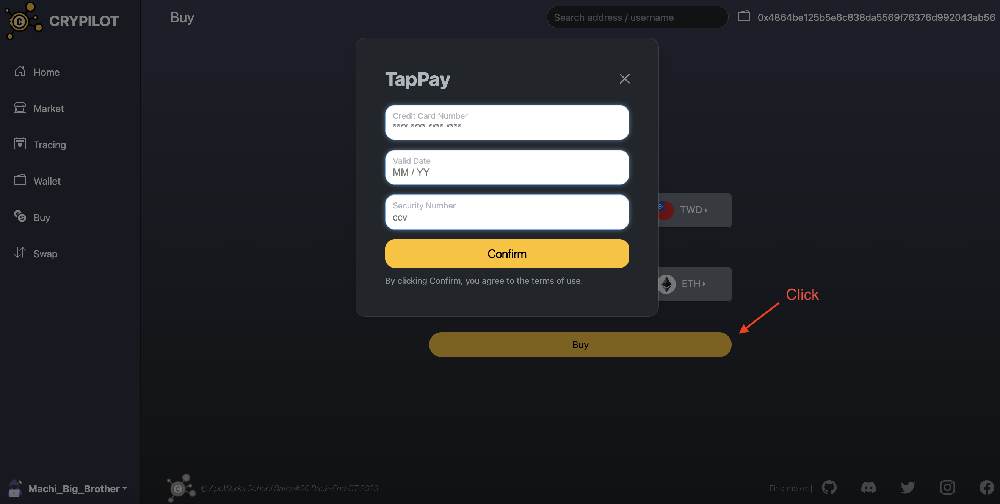

#### 8. Swap page, buy or sell crypto on-chain through Uniswap V3.

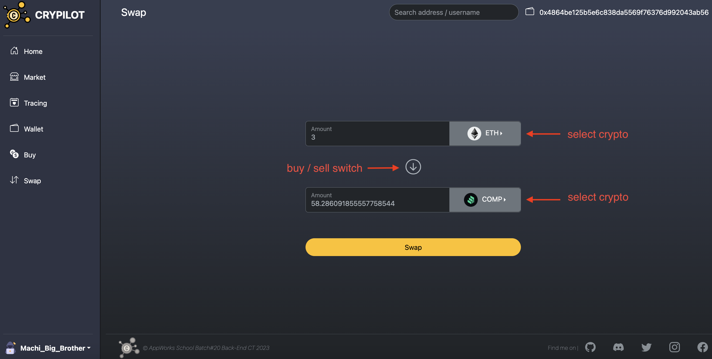

#### 9. Wallet page, check cryptos you possess.

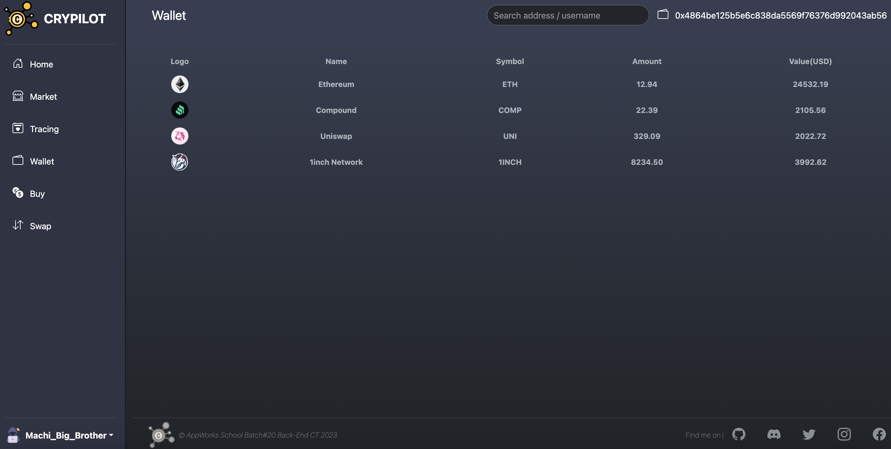

#### 10. Retrieve the private key of your wallet, take back ownership.

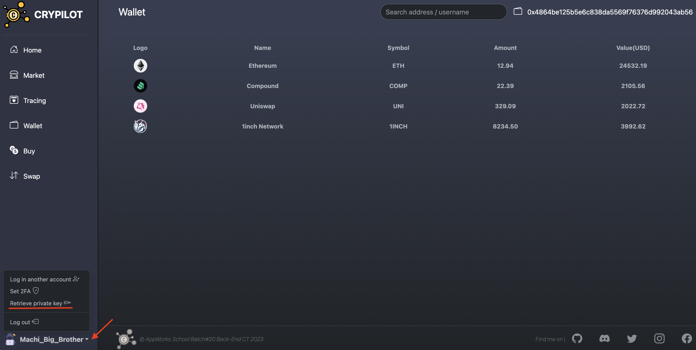
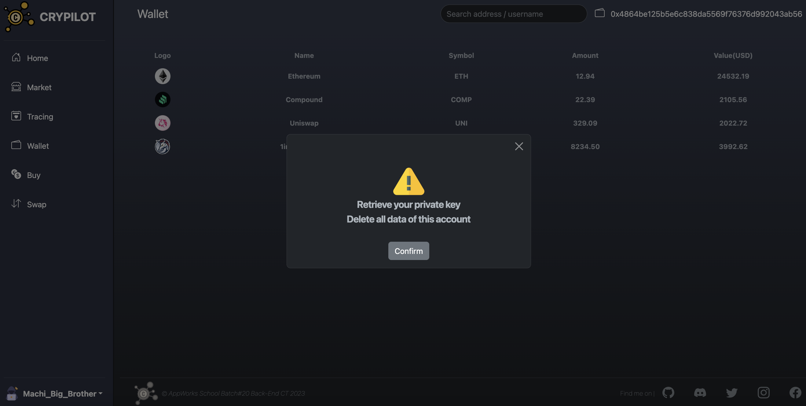
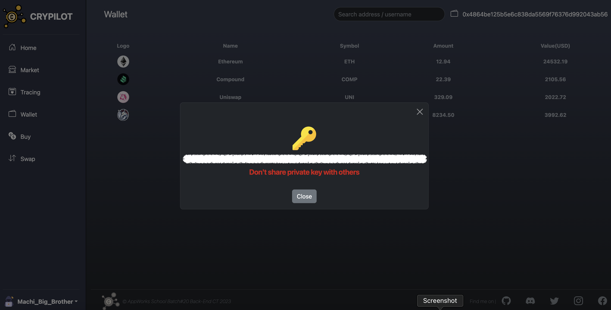

## 💻 Tech Stack

**Client:** JavaScript, HTML, CSS, Bootstrap

**Server:** Node, Express, MySQL, Redis, Socket.IO, RabbitMQ

**Blockchain:** Solidity, Hardhat

## ⚙️ Swap System Architecture

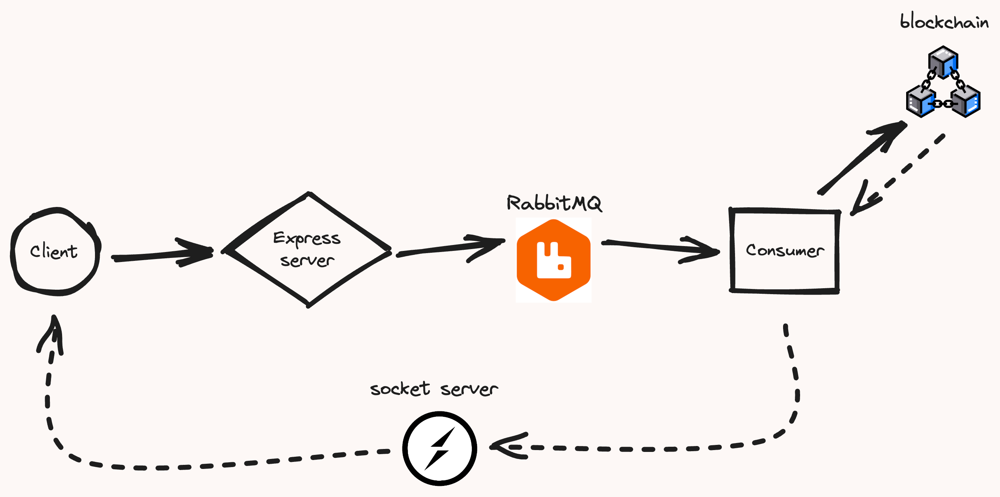

## 🔗 Links

