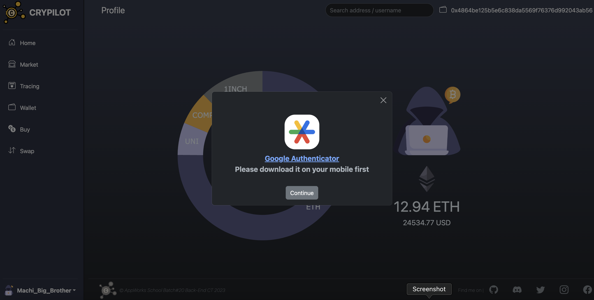

# 
CRYPILOT [[Website]](https://ctceth.com/)

A web3 wallet, integrating custodian, quotation, and trading features to make it easier for web3 beginners to experience Blockchain.

## Table of Contents

- [👨🏻‍💻 User Flow](#user-flow)
- [💻 Tech Stack](#tech-stack)
- [⚙️ Architecture](#system-architecture)
- [🗄️ DB Schema](#db-schema)
- [🔗 Contacts](#contacts)

## User Flow

#### Testing Account

- email: appworks@gmail.com
- password: 123

#### 1. Register

#### 2. Login

#### 3. Profile page, check the percentage of assets and ETH balance.

#### 4. Set the 2FA for assets security

#### download [[Google Authenticator]](https://apps.apple.com/us/app/google-authenticator/id388497605)

#### scan QR code by Google Authenticator

#### login next time, you have to give security code to verified

#### 5. Market page, get instant price of cryptos and add the interesting crypto into tracing list. Furthermore, click the chat button, obtain crypto information from ChatGPT.

#### 6. Tracing page, check your all tracing cryptos.

#### 7. Buy page, buy ETH by fiat currency through credit card.

#### Testing Credit Card

- Credit Card Number: 4242 4242 4242 4242
- Valid Date: 09/23
- Security Number: 123

#### 8. Swap page, buy or sell crypto on-chain through Uniswap V3.

#### 9. Wallet page, check cryptos you possess.

#### 10. Retrieve the private key of your wallet, take back ownership.

## Tech Stack

### Back-End:

### Blockchain:

### Cloud Service(AWS):

### Front-End:

## System Architecture

### Buy / Swap Flow

### OpenAI / Quotation / Tracing Flow

## DB Schema

## Contacts

